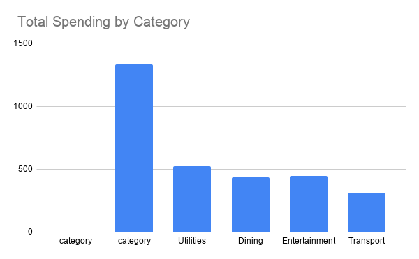
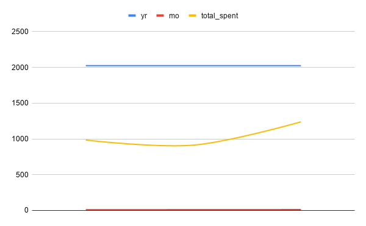

# Expense Log Analysis

SQL analysis of 40 personal expenses over Q4 2024 to identify spending patterns and opportunities for reduction.

## Business Question

Where is my money going each month, and which categories offer the biggest opportunity to reduce spending?

## Data Source

- **Source:** Personal finance tracking
- **Period:** October – December 2024
- **Size:** 40 transactions across 5 categories
- **Structure:** Single table (`expenses`) — see [schema.sql](schema.sql)
- **Sample data:** [data.sql](data.sql)

## Tools Used

- **Database:** [MySQL / PostgreSQL / SQLite — whatever you're using in PopSQL]
- **Analysis:** SQL (aggregations, CASE statements, date filtering)
- **Visualization:** Google Sheets

## Approach

1. Designed a single-table schema with typed columns (`DATE`, `DECIMAL`) rather than using generic strings.
2. Wrote 10 questions a real user would ask about their own spending.
3. Answered each with SQL — full code in [queries.sql](queries.sql).
4. Aggregated results into two charts to make the trends visible.

## Key Findings

1. **Groceries dominate spending.** At $[1,333.80], Groceries account for **[42%]** of total spend — more than Utilities and Dining combined.
2. **December spike.** December spend was **[$1,029.60]**, up **[5.5%]** from October and **[13%]** over November, driven by holiday dining and gifts.
3. **The largest single expense** was **$[220.00]** for "Gifts" in December — **[2.4x]** the average transaction size.
4. **Utilities are the most predictable category**, staying within a [$60–$149] range all quarter.

## Recommendation

Cutting Dining out would have minimal impact — it's only [13%] of total spend and mostly driven by special occasions. **Groceries is the only category with enough volume to matter.** A 10% reduction there would save approximately **$[133]** per quarter, which is more than eliminating Dining entirely.

## Visualizations

## Files in this repository

| File | Purpose |
|------|---------|
| [schema.sql](schema.sql) | Table definition |
| [data.sql](data.sql) | Sample data (40 rows) |
| [queries.sql](queries.sql) | All 10 analysis queries with the question they answer |
| [chart_category.png](chart_category.png) | Spending by category |
| [chart_month.png](chart_month.png) | Monthly spending trend |
